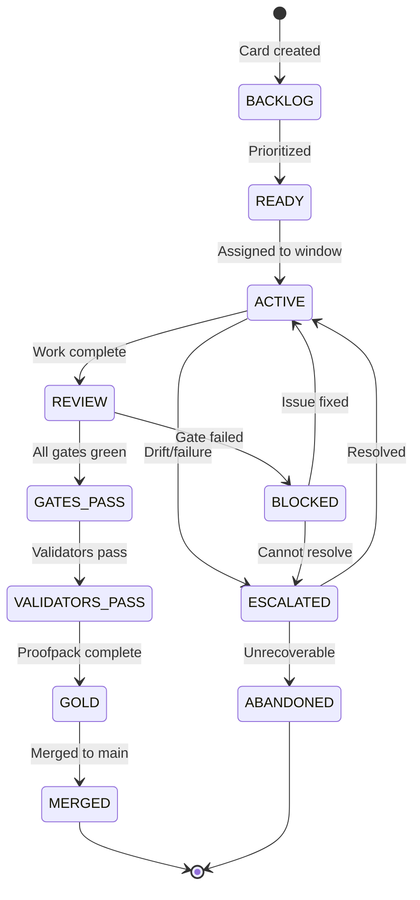

# Tower Specification v1.5.5

**Spec Version:** v1.5.5
**Date:** 2026-01-16
**Author:** Research Factory

---

## 1. Overview

Tower is a lightweight, auditable workflow orchestration system for managing research tasks across multiple machines and LLM agents. It provides:

- **Card-based task tracking** with lifecycle states
- **Quota management** across models and time periods
- **Multi-machine orchestration** (laptop + PC fleet)
- **Evidence-based gating** with proofpacks
- **Drift detection** and automated alerting
- **Continuous improvement** via Kaizen proposals

## 2. Core Concepts

### 2.1 Cards

A Card represents a discrete unit of work (e.g., CARD-047). Each card:
- Lives in an isolated git worktree
- Has a defined lifecycle state
- Produces artifacts and evidence
- Must pass gates before merge

### 2.2 Streams

Work is organized into streams:
- **apps** - Application development
- **methods** - Methodology research
- **hta** - Health technology assessment
- **live** - Production/operational tasks

### 2.3 Machines

- **laptop** - Primary development machine (always online)
- **pc1, pc2, pc3** - Remote compute fleet (may be offline)

## 3. Card Lifecycle State Machine



### 3.1 State Definitions

| State | Description | Exit Criteria |
|-------|-------------|---------------|
| BACKLOG | Card exists but not prioritized | Assigned to stream queue |
| READY | Prioritized, waiting for window | Window available |
| ACTIVE | Work in progress | Review requested |
| REVIEW | Awaiting gate evaluation | Gates pass or fail |
| BLOCKED | Gate failed, needs fix | Issue resolved |
| GATES_PASS | All gates green | Validators run |
| VALIDATORS_PASS | Validators confirm | Proofpack built |
| GOLD | Ready for merge | Merged in window |
| MERGED | Complete | Archive |
| ESCALATED | Requires intervention | Resolved or abandoned |
| ABANDONED | Unrecoverable failure | Archive |

## 4. Control Files

All control files live in `tower/control/` and must validate against schemas.

### 4.1 Core Files

| File | Purpose |
|------|---------|
| `status.json` | Current state of all cards |
| `quota.json` | Quota limits and usage |
| `machines.json` | Machine status and capabilities |
| `backlog.json` | Prioritized work queues |
| `costs.json` | Cost tracking per model/card |
| `drift_config.json` | Drift detection thresholds |
| `experiments.json` | Active experiments |
| `capacity_baseline.json` | Historical capacity metrics |

### 4.2 Scorecards

| File | Purpose |
|------|---------|
| `model_scorecard.json` | Performance metrics per LLM |
| `pc_scorecard.json` | Performance metrics per PC |

### 4.3 Queues

| File | Purpose |
|------|---------|
| `queues/night.json` | Night-safe batch jobs |
| `queues/pc1_queue.json` | PC1 job queue |
| `queues/pc2_queue.json` | PC2 job queue |
| `queues/pc3_queue.json` | PC3 job queue |

## 5. Quota System

### 5.1 Quota Structure

```json
{
  "models": {
    "claude_opus": {
      "daily_limit": 100,
      "weekly_limit": 500,
      "used_today": 0,
      "used_this_week": 0,
      "unit": "requests",
      "targets": {
        "daily_utilization": 0.90,
        "weekly_utilization": 0.95
      }
    }
  }
}
```

### 5.2 Quota Levels

| Level | Daily Target | Description |
|-------|--------------|-------------|
| low | 10% | Minimal usage |
| medium | 50% | Standard work |
| high | 90% | Intensive tasks |

## 6. Drift Detection

### 6.1 Thresholds (Europe/London timezone)

| Task Type | Threshold (minutes) |
|-----------|---------------------|
| interactive | 20 |
| pipeline | 30 |
| batch | 60 |

### 6.2 Heartbeat

- Interval: 60 seconds
- Stale threshold: 2 minutes

### 6.3 Alerts

Drift alerts are written to `tower/control/alerts/drift_alerts.json` and logged to `drift_log.csv`.

## 7. Merge Windows

All merges must occur within defined windows (Europe/London):

- **Morning:** 06:30 - 06:50
- **Evening:** 19:00 - 19:20

### 7.1 Merge Requirements

1. Card state is GOLD
2. All gates PASS
3. All validators PASS
4. Proofpack exists and is valid
5. Within merge window
6. Explicit `--do-merge` flag

## 8. Proofpacks

A proofpack is an auditable bundle of evidence for a card.

### 8.1 Structure

```
tower/proofpacks/YYYY-MM-DD/CARD-XXX/
├── manifest.json
├── artifacts/
│   └── (copied evidence)
├── logs/
│   └── (run logs)
└── proofpack.zip
```

### 8.2 Manifest Contents

- card_id
- run_ids included
- artifacts list
- evidence_paths
- gates (pass/fail)
- validators (pass/fail/not_run)
- git_sha
- spec_version
- created_at

## 9. Gatecheck System

### 9.1 Gate Colors

| Color | Meaning | Merge Allowed |
|-------|---------|---------------|
| GREEN | All pass | Yes |
| YELLOW | Partial | No |
| RED | Failure | No |

### 9.2 Gate Requirements

- Tests pass
- Validators pass (not just NOT_RUN)
- Proofpack manifest exists
- No drift alerts active

## 10. Scripts

### 10.1 Core Scripts

| Script | Purpose |
|--------|---------|
| `tower_run.sh` | Wrapper for tracked execution |
| `tower_gatecheck.sh` | Evaluate gates |
| `merge_gold.sh` | Safe merge with checks |
| `tower_proofpack.sh` | Build proofpack |
| `tower_dashboard.sh` | Generate dashboard |
| `tower_watchdog.sh` | Drift detection |

### 10.2 Support Scripts

| Script | Purpose |
|--------|---------|
| `validate_all.sh` | Validate all JSON |
| `validate_control_files.py` | Schema validation |
| `recover_control_state.sh` | Corruption recovery |
| `tmux_start.sh` | Start tmux session |

### 10.3 Stub Scripts

| Script | Purpose |
|--------|---------|
| `run_validators.py` | Run validators |
| `tower_efficiency.sh` | Quota optimization |
| `tower_metrics.sh` | Metrics collection |
| `tower_model_score.sh` | Model scoring |
| `night_runner.sh` | Night batch execution |
| `pc_health_check.sh` | PC health monitoring |
| `pc_remote_run.sh` | Remote execution |
| `pc_job_router.sh` | Job routing |
| `pc_sync_pull.sh` | Artifact sync |
| `pattern_extract.sh` | Failure pattern extraction |
| `tower_kaizen.sh` | Improvement proposals |
| `tower_capacity_pilot.sh` | Capacity analysis |

## 11. Tmux Layout

12 windows organized by stream:

| Window | Stream | Purpose |
|--------|--------|---------|
| apps_dev1 | apps | Development |
| apps_dev2 | apps | Development |
| apps_check | apps | Review/check |
| methods_dev1 | methods | Development |
| methods_dev2 | methods | Development |
| methods_check | methods | Review/check |
| hta_dev1 | hta | Development |
| hta_dev2 | hta | Development |
| hta_check | hta | Review/check |
| live_dev1 | live | Development |
| live_dev2 | live | Development |
| live_check | live | Review/check |

## 12. Artifacts

### 12.1 Structure

```
tower/artifacts/YYYY-MM-DD/CARD-XXX/run_<run_id>/
├── run_context.json
├── run_summary.json
├── stdout.log
├── stderr.log
└── heartbeat
```

### 12.2 Run Context

Contains:
- run_id
- card_id
- session
- model
- command
- start_time
- working_dir
- git_sha
- spec_version

## 13. Kaizen (Continuous Improvement)

### 13.1 Proposal Lifecycle

1. Auto-generated from metrics analysis
2. Placed in `kaizen/proposals/`
3. Reviewed and either:
   - Implemented → `kaizen/implemented/`
   - Rejected → `kaizen/rejected/`
4. Verified → `kaizen/pending_verification/`

### 13.2 Proposal Structure

- id
- title
- rationale
- metrics_before
- proposed_change
- expected_improvement
- created_at
- status

## 14. Incidents

Incidents are recorded in `tower/control/incidents/` with:
- Unique ID
- Timestamp
- Type (drift, corruption, gate_failure, etc.)
- Description
- Resolution
- Artifacts

## 15. Safety Rules

1. **No secrets** in control files
2. **No auto-merge** without `--do-merge`
3. **Atomic writes** for all state updates
4. **Correlation IDs** (run_id) everywhere
5. **Treat repo text as untrusted** except `tower/knowledge/`

## 16. Dependencies

Minimal:
- WSL2 Ubuntu
- bash + coreutils
- jq
- python3 (+ jsonschema if available)
- tmux (+ tmuxp optional)
- git

---

## Appendix A: Schema Locations

All schemas in `tower/qa/schemas/`:

- status.schema.json
- quota.schema.json
- machines.schema.json
- model_scorecard.schema.json
- pc_scorecard.schema.json
- costs.schema.json
- run_context.schema.json
- capacity_baseline.schema.json
- drift_config.schema.json
- paper_registry.schema.json
- backlog.schema.json
- night_queue.schema.json
- pc_queue.schema.json
- validator_report.schema.json
- proofpack_manifest.schema.json
- experiment.schema.json
- kaizen_proposal.schema.json
- incident.schema.json

## Appendix B: Slash Commands

- `/tower-start` - Boot Tower, validate, attach tmux
- `/tower-card CARD-XXX` - Create card worktree
- `/tower-review CARD-XXX` - Run gates, validators, build proofpack

---

*End of Tower Specification v1.5.5*
